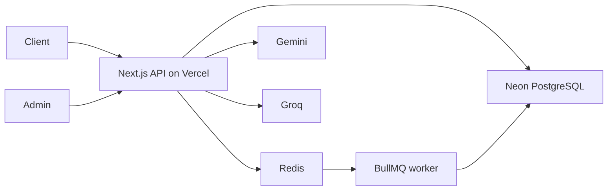

# LLMGate

LLMGate is a multi-tenant AI API gateway and admin dashboard. A client sends one OpenAI-style chat request to `POST /api/v1/proxy`; the gateway authenticates the client's API key, enforces a request limit and tenant budget, redacts common sensitive strings, selects a model, streams the answer, and records usage for the dashboard. Internal Redis keys, database names, and response headers retain the original AuraGate service identifier.

It is built as an interview-ready demonstration of gateway tradeoffs, not as a general-purpose AI platform.

## What it does

- **Routing:** simple prompts use Gemini 2.5 Flash, code prompts use Groq GPT OSS 120B, and more complex prompts use Gemini 3.5 Flash. Clients can explicitly select either Gemini model.
- **Failover:** an upstream error before streaming starts triggers one fallback attempt to Gemini Flash. An error after streaming starts sends an SSE error event; it cannot safely replay already delivered tokens.
- **Budgets:** an atomic PostgreSQL update reserves a conservative maximum cost before the provider call. A BullMQ worker uses reported token counts to charge the actual amount and refund the rest. A failed request is refunded.
- **Rate limit and cache:** Redis runs a per-key sliding window limit and a tenant-scoped exact-prompt cache. Cache hits return the same SSE format and cost no provider tokens.
- **Privacy:** emails, phone numbers, payment-card-like strings, US SSNs, and common secret assignments are redacted from all message roles before the provider call. This is regex redaction, not a guarantee that all sensitive content is detected.
- **Admin:** password-protected dashboard for tenant budgets, API keys, request history, routing, latency, provider mix, and cost. Keys are stored as hashes and the raw key is shown only when created.
- **Observability:** each request has an ID. A worker writes usage to a partitioned PostgreSQL table. `GET /api/health` checks PostgreSQL, Redis, and the worker heartbeat.



The proxy and worker use the Node.js runtime. The response is Server-Sent Events (SSE), including on cache hits. Usage is queued before the final `[DONE]` event, so accounting does not depend on a background task surviving after a Vercel function finishes.

## Local setup

Requires Node.js 22+, npm, Docker, a Gemini API key, and a Groq API key.

1. `npm ci`
2. Copy `.env.example` to `.env`. Set `GEMINI_API_KEY`, `GROQ_API_KEY`, `ADMIN_PASSWORD`, and a random `ADMIN_JWT_SECRET` of at least 32 characters. The example database and Redis URLs are for the Compose services. If using Neon, replace `DATABASE_URL` with its connection string.
3. Start Redis and, if you are not using Neon, PostgreSQL: `docker compose up -d`
4. Apply schema and create monthly usage partitions: `npm run db:migrate`
5. In separate terminals, run `npm run worker` and `npm run dev`.
6. Open `http://localhost:3000/admin-login`, log in, create a tenant, and create an API key. `http://localhost:3000/api/health` should show all three checks as `ok`.

The worker must keep running while you send requests; it reconciles budgets and populates the dashboard. Run `npm run db:partitions` periodically to create future monthly partitions.

## Example request

```bash
curl -N http://localhost:3000/api/v1/proxy \
  -H 'Authorization: Bearer ag_YOUR_API_KEY' \
  -H 'Content-Type: application/json' \
  -d '{"messages":[{"role":"user","content":"Explain how a database index works."}],"model":"auto"}'
```

The endpoint accepts 1–50 `system`, `user`, or `assistant` messages, up to 100,000 total content characters, optional `temperature` between 0 and 2, and `model` set to `auto`, `gemini-2.5-flash`, or `gemini-3.5-flash`. Output is capped at 1,024 tokens. It streams SSE `data:` events and ends with `data: [DONE]`. Errors after streaming starts arrive as `event: error`.

## Deploy

The intended split is **Vercel for Next.js**, **Neon for PostgreSQL**, and **Render Free Key Value plus a Render Free Web Service for the BullMQ worker**. The worker is configured as a Web Service, not Render's paid Background Worker. Its `/healthz` endpoint lets an incoming gateway request wake it after Render spins it down.

1. Apply migrations against Neon from a trusted machine: set `DATABASE_URL` in local `.env`, then run `npm run db:migrate`. Use a Neon connection string suitable for migrations.
2. In Render, create a Blueprint from this repository's `render.yaml`. Confirm that **both** resources show the **Free** plan: `auragate-redis` (Key Value) and `auragate-worker` (Web Service). Enter the Neon `DATABASE_URL` when prompted. The Blueprint connects the worker to Redis over Render's internal network.
3. In the Render Key Value page, copy its **External URL**. It must start with `rediss://`, which enables TLS and password authentication. The Blueprint permits external IPs because Vercel's outbound addresses change; keep this URL secret. The Key Value policy is `noeviction` so the cache cannot evict BullMQ jobs.
4. In Vercel, set `DATABASE_URL` to the Neon application URL, `REDIS_URL` to Render's **External URL**, and `WORKER_WAKE_URL` to `https://auragate-worker.onrender.com` (use the actual URL Render shows). Also set `GEMINI_API_KEY`, `GROQ_API_KEY`, `ADMIN_PASSWORD`, and `ADMIN_JWT_SECRET`.
5. Visit the worker's `/healthz` URL, then the Vercel app's `/api/health`. Create a tenant and key in the dashboard. Send the example proxy request twice; the second response should have `X-Cache: HIT`. Check that a usage row and budget change appear after the worker wakes.

The app and worker must use the **same** Neon database and Redis instance. On Vercel, use a Neon pooled application URL where available; keep pool sizes modest (`DB_POOL_SIZE`, default 3) because serverless instances each make their own pool.

Render Free Web Services sleep after 15 minutes without incoming HTTP traffic. The first proxy request starts an HTTP wake request while the LLM runs; queued usage may take about a minute to appear after a cold start. Render Free Key Value stores data only in memory: a restart can lose queued jobs and cached data. Stale budget reservations are released by the cleanup job after the worker next runs, but lost usage jobs cannot be recovered. This is suitable for an interview demo, not reliable billing. Render's free allowances also have monthly usage limits; check usage in your Render dashboard to keep spending at $0.

## Design choices and limits

- Pricing is a checked-in snapshot for the three supported models. Update `src/lib/queue/cost-calculator.ts` when provider prices change. The budget reservation uses an upper bound; provider reports determine the final charge.
- Redis rate limiting fails open if Redis is unavailable, but authentication and the PostgreSQL budget gate still apply. The health endpoint reports Redis or worker outages.
- Exact-prompt caching includes tenant, model selection, sanitized messages, and temperature. It does not do semantic matching.
- The gateway supports text chat and SSE only. It does not proxy tools, images, file uploads, or non-streaming responses.
- A scheduled worker job refunds budget reservations older than 15 minutes when their usage job was never enqueued. Failed jobs retain their reservation for inspection and retry.
- The admin login is a single shared password. For a larger deployment, replace it with individual accounts and audit logs.

## Checks

```bash
npm test
npm run lint
npx tsc --noEmit --incremental false
npm run build
```

With local PostgreSQL and Redis running, start the worker and run `npm run test:integration` to check concurrent budget admission, usage settlement, and orphan refunds.
